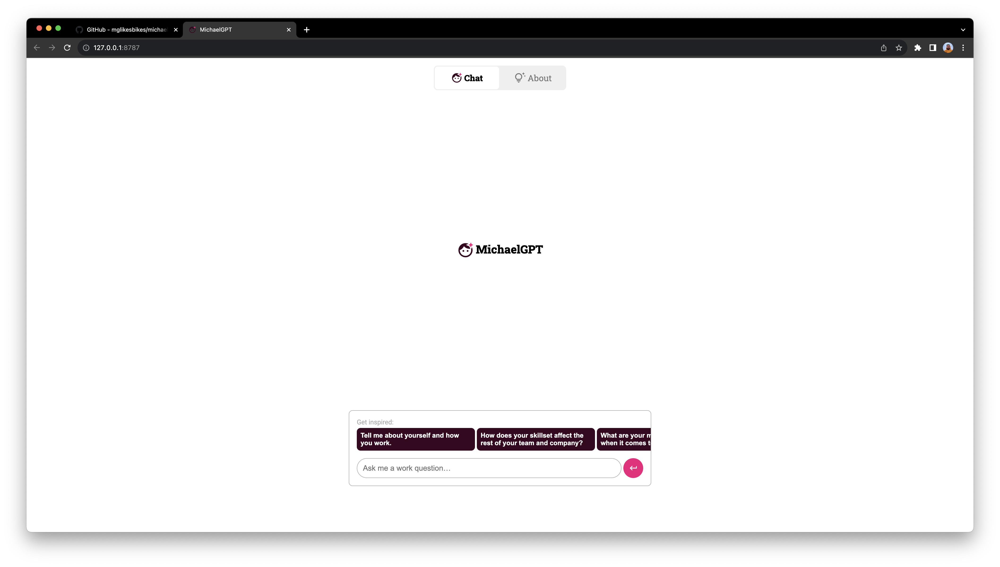

# [<span style="background:#fff;border-radius:4px;padding:.5rem;vertical-align:middle;color:#000;text-decoration:underline">MichaelGPT <small>↗</small></span>](https://michaelgpt.pocketrides.workers.dev/)

**Ask my AI work-related questions ✨**

A portfolio piece designed, developed and architected by fullstack developer [Michael Griffith](https://linkedin.com/in/mjg000000). Runs on Cloudflare [Workers AI](https://developers.cloudflare.com/workers-ai/tutorials/build-a-retrieval-augmented-generation-ai/) and [Vectorize](https://developers.cloudflare.com/vectorize/). Built in [SvelteKit](https://kit.svelte.dev).

### Resources

- [Figma design prototype](https://www.figma.com/proto/SEYbpEiyZsT6V3XsGH9F04/MichaelGPT)
- [Figjam architecture diagram](https://www.figma.com/file/KsNtdYQF0H8tCEDnhl5ANm/MichaelGPT---Architecture)

<table><tr>
<td></td>
<td></td>
<td></td>
<td></td>
<td></td>
</tr></table>

## Environment setup

### Step 1: run `npm install`

<details style="border:1px solid #000;padding:1rem 1rem;border-radius:1rem;margin-bottom: 1rem;">
<summary><span style="font-size:1.25rem;font-weight:bold;color:#ff0;">⚠️ Getting an error?</span></summary>

`SyntaxError: Named export 'Ai' not found.`  
**How to resolve:** The Cloudflare AI library shipped in CommonJS format. Hopefully this is fixed soon!

#### Step 1:

Add `"type":"module"` to `node_modules/@cloudflare/ai/package.json`

#### Step 2:

Open `node_modules/@cloudflare/ai/dist` and add `.js` to the ends of the imports, **in all files.**

##### Before (`ai.js`):

```
import { Tensor, TensorType } from "./tensor";
import { InferenceSession } from "./session";
import { resnetLabels } from "./labels";
```

##### After (repeat this for all files):

```
import { Tensor, TensorType } from "./tensor.js";
import { InferenceSession } from "./session.js";
import { resnetLabels } from "./labels.js";
```

</details>

### Step 2: Cloudflare-specific setup

#### Part 1: Create the `wrangler.toml` file

1. Copy the provided `wrangler.toml.example` file and rename it to `wrangler.toml`
2. Run `npx wrangler@latest login`
   - **Important:** at launch, Cloudflare's AI products are restricted to paid accounts. You will need to provide a credit card to Cloudflare in order to run this.
3. Add your account id to `wrangler.toml`
4. Give your worker a name, `name="my-bot"`

#### Part 2: Create the KV store to hold questions and answers.

Cloudflare KV is an edge-based key-value store. It's extremely fast and can be thought of as a programmable static cache. Because of this, writes to KV are slightly delayed to end users.

This project uses KV to store a JSON blob, keyed with a `content_id` (UUID): `{"question:": "Question", "answer": "My answer"}` — embeddings are created based on the question and answer, and retrieved through Vectorize later.

Create a KV store in your account:

```sh
  $ npx wrangler@latest kv:namespace create DATASET
```

This command returns an ID, add it to your `wrangler.toml` and use the same ID for `id` and `preview_id`. You may have to comment out the `kv_namespaces` block of your wrangler file to run this step.

#### Part 3: Create the Vectorize index to hold embeddings

Vectorize is how we take natural language ("what's your favorite color?") and find matching questions and answers ("orange") that we pre-populated in the admin backend.

```sh
$ npx wrangler@latest vectorize create dataset-vectors --dimensions=1536 --metric=cosine
```

Note: the binding in `wrangler.toml` is `DATASET_VECTORS` to align its domain with the KV store. (See: `app.d.ts` for full bindings.)

### Step 3: Build, Develop, and Deploy

Local development can be done in two ways:

- Using the provided `dev` script. This is SvelteKit's default way of development, and gives you things like HMR and a stable local server. **It should only be used for developing the frontend.**
- Using the provided `2-dev-remote` script. This runs `wrangler` in "remote dev" mode: it syncs the build output to Cloudflare's servers, and proxies your dev machine to its remote infrastructure. It therefore does not include things like HMR, which is why `1-watch-remote` exists, to watch your local files, build them, and re-sync them to Cloudflare.

Just to be exceedingly clear:

- For local-only frontend dev, use `dev`
- For full-stack development, use `1-watch-remote` _and_ `2-dev-remote`

More details on the build scripts:

- `1-watch-remote`: watch script that builds the sveltekit app for `wrangler dev --remote` development
- `2-dev-remote`: because Cloudflare's AI features are remote-only at this time, we need to run our dev server in "remote" mode, which takes the built output from step 1 and uploads it to a preview environment. We use `.dev.vars` to tell us if we are in that preview mode or not, to protect our `/admin` route
- `3-deploy`: deploys the built app to your subdomain, e.g. `<worker name>.<account name>.workers.dev`
- `4-debug`: starts a logging session for the remote server (during dev, you see all debug logs in terminal like normal)

### Step 4: Populate data

Provided you ran the setup gauntlet, you'll want to run `2-dev-remote` and open the provided URL in a browser. Visit `http://localhost:${port}/admin` to begin adding questions and answers the bot can use to give great answers to users.

#### Key components

The backend heavy-lifting is done in three files:

##### 1. `src/lib/admin/ai/destroy.ts`

Handles deleting data from KV and Vectorize. Implemented in `src/routes/admin/question/[content_id]/destroy/+server.ts`

##### 2. `src/lib/admin/ai/upsert.ts`

Handles creating, and updating content in the KV store and Vectorize index. Implemented in:

- `src/routes/admin/question/new/+page.server.ts`
- `src/routes/admin/question/[content_id]/+page.server.ts`

##### 3. `src/lib/chat/query.ts`

Performs the query for the frontend side of things (including generating the prompt). Implemented in `src/routes/chat/+server.ts`

### Questions? Open an issue!

Feel free to fork this repo, I personally think Cloudflare is the most exciting of the new-generation serverless infrastructure providers — though it comes with a steep learning curve. I'm happy to help answer any questions, fix any bugs you find, etc., but don't get it twisted: I built this as a portfolio piece to showcase my fullstack abilities as a UX designer, technical architect, and fullstack Typescript developer.

If you're looking for someone who wears as many hats as will fit, [connect with me on LinkedIn](https://linkedin.com/in/mjg000000).

#### Copyright notice

At time of dev (Oct 2023), "GPT" is not trademarked by OpenAI. That said, for future reference: GPT stands for Generative Pre-training Transformer, a framework invented by OpenAI. Imitation is the most sincere form of flattery! DMCA requests please forward to <michael@pocketrides.cc>.
